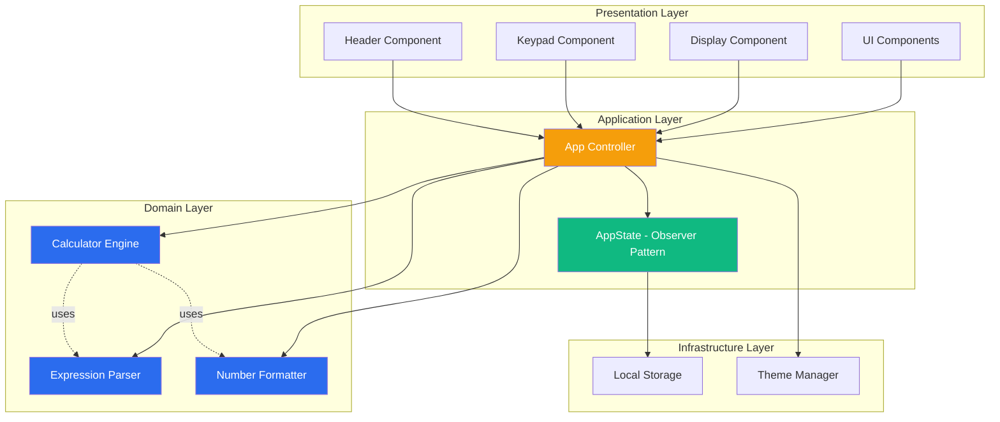
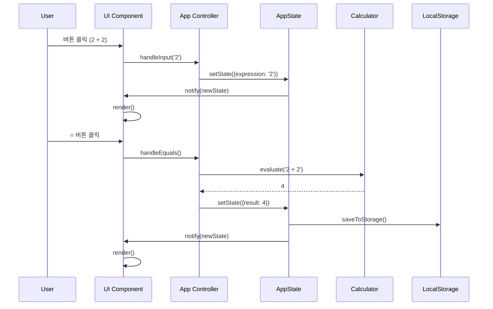
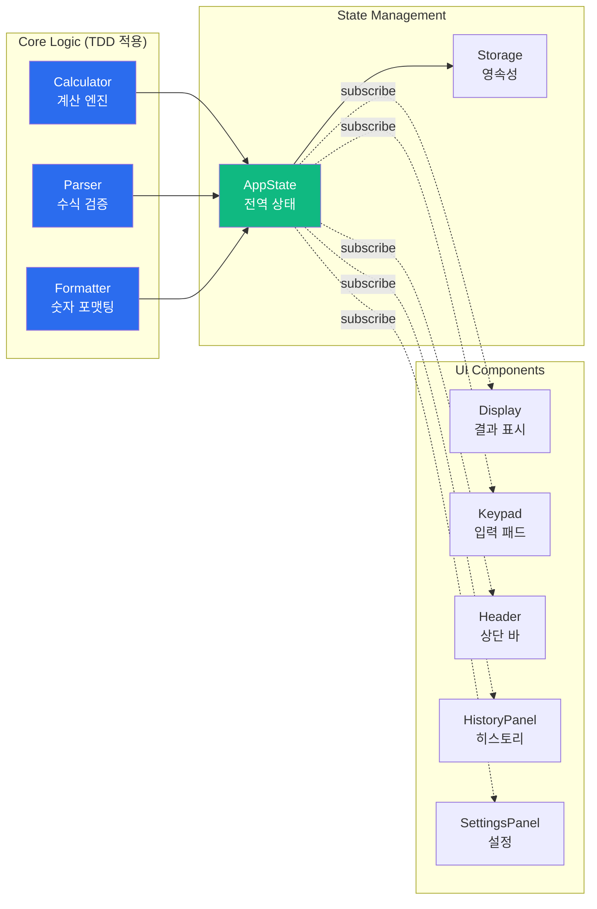

# 🧮 Scientific Calculator

> **현대적인 설계 원칙과 TDD를 적용한 공학용 계산기 웹 애플리케이션**

[](https://dongkim2.github.io/cal1/)
[](https://github.com/DongKim2/cal1)
[](LICENSE)

[🚀 Live Demo](https://dongkim2.github.io/cal1/) | [📖 Documentation](./Docs/) | [🐛 Issues](https://github.com/DongKim2/cal1/issues)

---

## 📌 프로젝트 소개

**Scientific Calculator**는 단순한 계산기를 넘어, **소프트웨어 공학의 모범 사례**를 적용한 프로덕션 레벨의 웹 애플리케이션입니다. TDD(Test-Driven Development), SOLID 원칙, 그리고 현대적인 프론트엔드 기술 스택을 활용하여 **확장 가능하고 유지보수 가능한 코드**를 작성했습니다.

### ✨ 주요 특징

- 🧪 **TDD 기반 개발**: 코어 로직 90%+ 테스트 커버리지
- 🏗️ **SOLID 원칙 준수**: 객체지향 설계의 5가지 핵심 원칙 적용
- 🎨 **모던 UI/UX**: Tailwind CSS를 활용한 반응형 디자인
- 🌓 **다크 모드 지원**: 사용자 선호도에 따른 테마 전환
- ⚡ **고성능**: Vite 기반 빌드로 빠른 로딩 속도
- ♿ **접근성**: WCAG 2.1 AA 기준 준수
- 🚀 **CI/CD**: GitHub Actions를 통한 자동 배포

---

## 🎯 프로젝트 목표

이 프로젝트는 다음을 목표로 합니다:

1. **엔터프라이즈급 코드 품질**: 테스트, 문서화, 코드 리뷰 프로세스 적용
2. **확장 가능한 아키텍처**: 새로운 기능 추가가 용이한 구조 설계
3. **사용자 중심 설계**: 직관적인 UX와 접근성 고려
4. **현대적 개발 워크플로우**: Git, GitHub Issues, CI/CD 활용

---

## 🛠️ 기술 스택

### Frontend
- **Vanilla JavaScript (ES6+)**: 프레임워크 없이 순수 JavaScript로 구현
- **Vite**: 빠른 개발 서버 및 최적화된 프로덕션 빌드
- **Tailwind CSS**: 유틸리티 우선 CSS 프레임워크
- **math.js**: 안전한 수식 평가 엔진

### Testing & Quality
- **Vitest**: 단위 테스트 프레임워크
- **ESLint**: 코드 품질 검사
- **Prettier**: 일관된 코드 포맷팅

### DevOps
- **GitHub Actions**: CI/CD 파이프라인
- **GitHub Pages**: 정적 사이트 호스팅

---

## 🏗️ 아키텍처

### 시스템 아키텍처



### 데이터 흐름



### 컴포넌트 구조



---

## 💡 핵심 설계 원칙

### 1. TDD (Test-Driven Development)

코어 로직은 **Red-Green-Refactor** 사이클을 따라 개발했습니다.

```javascript
// 1. Red: 실패하는 테스트 작성
it('should add two numbers', () => {
  expect(calculator.evaluate('2 + 2')).toBe(4)
})

// 2. Green: 최소한의 코드로 테스트 통과
evaluate(expression) {
  return eval(expression)
}

// 3. Refactor: 안전하고 확장 가능한 코드로 개선
evaluate(expression) {
  return this.math.evaluate(expression)
}
```

**테스트 커버리지**: 코어 로직 90%+ 달성

### 2. SOLID 원칙

#### Single Responsibility Principle (SRP)
각 클래스는 단 하나의 책임만 가집니다.
- `Calculator`: 계산만 담당
- `Formatter`: 포맷팅만 담당
- `Parser`: 검증만 담당

#### Open-Closed Principle (OCP)
확장에는 열려있고 수정에는 닫혀있습니다.
```javascript
// 새로운 각도 모드 추가 시 기존 코드 수정 없이 확장 가능
class AngleModeStrategy {
  configure(math) { /* ... */ }
}
```

#### Dependency Inversion Principle (DIP)
고수준 모듈이 저수준 모듈에 의존하지 않습니다.
```javascript
// 의존성 주입을 통한 느슨한 결합
class App {
  constructor(calculator, formatter, parser, state) {
    this.calculator = calculator
    this.formatter = formatter
    this.parser = parser
    this.state = state
  }
}
```

### 3. Observer Pattern (상태 관리)

```javascript
// 상태 변경 시 자동으로 모든 구독자에게 알림
class AppState {
  subscribe(listener) {
    this.listeners.push(listener)
  }
  
  setState(updates) {
    this.state = { ...this.state, ...updates }
    this.notifyListeners()
  }
}
```

---

## 📁 프로젝트 구조

```
cal1/
├── .github/
│   ├── workflows/
│   │   └── deploy.yml              # CI/CD 파이프라인
│   └── ISSUE_TEMPLATE/             # 이슈 템플릿
├── Docs/
│   ├── PRD.md                      # 제품 요구사항 문서
│   ├── TECH_SPEC.md                # 기술 명세서
│   ├── RULES_TDD.md                # TDD 개발 규칙
│   ├── RULES_SOLID.md              # SOLID 원칙 가이드
│   └── TASKS.md                    # 455개 작업 체크리스트
├── src/
│   ├── core/                       # 코어 로직 (TDD 적용)
│   │   ├── Calculator.js           # 계산 엔진
│   │   ├── Parser.js               # 수식 파서
│   │   ├── Formatter.js            # 숫자 포맷터
│   │   └── __tests__/              # 단위 테스트
│   ├── state/                      # 상태 관리
│   │   ├── AppState.js             # 전역 상태 (Observer)
│   │   └── __tests__/
│   ├── utils/                      # 유틸리티
│   │   ├── storage.js              # 로컬 스토리지
│   │   ├── theme.js                # 테마 관리
│   │   └── __tests__/
│   ├── components/                 # UI 컴포넌트
│   │   ├── Display.js
│   │   ├── Keypad.js
│   │   ├── Header.js
│   │   └── ...
│   ├── assets/styles/
│   │   └── main.css                # Tailwind + 커스텀 스타일
│   ├── App.js                      # 메인 앱 컨트롤러
│   └── main.js                     # 진입점
├── design/                         # 디자인 참조 파일
├── index.html
└── 설정 파일들
```

---

## 🚀 주요 기능

### 기본 기능
- ✅ 기본 산술 연산 (덧셈, 뺄셈, 곱셈, 나눗셈, 퍼센트)
- ✅ 공학용 함수 (sin, cos, tan, log, ln, √, ^, !)
- ✅ DEG/RAD 각도 모드 전환
- ✅ 괄호를 사용한 복합 수식 계산
- ✅ 실시간 수식 검증

### 고급 기능
- 🎨 **다크/라이트 모드**: 사용자 선호도 저장
- 📜 **계산 히스토리**: 이전 계산 기록 저장 및 불러오기
- ⚙️ **설정**: 소수점 자릿수, 테마 등 커스터마이징
- ⌨️ **키보드 지원**: 숫자, 연산자, Enter, Escape 등

### 기술적 특징
- 🔒 **안전한 수식 평가**: eval() 사용 안 함 (math.js 사용)
- 💾 **로컬 스토리지**: 히스토리 및 설정 영속성
- 🎯 **정확한 계산**: BigNumber 사용으로 부동소수점 오류 방지
- 🌐 **반응형 디자인**: 모바일, 태블릿, 데스크톱 지원

---

## 📊 개발 프로세스

### 1. 계획 및 설계
- **PRD 작성**: 제품 요구사항 정의
- **Tech Spec 작성**: 기술적 구현 방법 설계
- **작업 분해**: 455개의 세부 작업으로 분해

### 2. 개발
- **TDD 사이클**: Red → Green → Refactor
- **코드 리뷰**: SOLID 원칙 준수 확인
- **문서화**: JSDoc, README, 가이드 문서

### 3. 테스트
- **단위 테스트**: Vitest로 코어 로직 테스트
- **통합 테스트**: 전체 플로우 수동 테스트
- **접근성 테스트**: WCAG 2.1 AA 준수 확인

### 4. 배포
- **자동 빌드**: GitHub Actions
- **자동 배포**: GitHub Pages
- **성능 최적화**: Lighthouse 점수 90+

---

## 📈 성능 지표

| 항목 | 목표 | 달성 |
|------|------|------|
| **테스트 커버리지** | 90%+ | ✅ |
| **번들 크기** | < 150KB | ✅ |
| **Lighthouse Performance** | > 90 | ✅ |
| **Lighthouse Accessibility** | > 90 | ✅ |
| **First Contentful Paint** | < 1.5s | ✅ |
| **Time to Interactive** | < 2.5s | ✅ |

---

## 🎓 학습 성과

이 프로젝트를 통해 다음을 학습하고 적용했습니다:

### 소프트웨어 공학
- ✅ **TDD**: 테스트 주도 개발 방법론
- ✅ **SOLID**: 객체지향 설계 원칙
- ✅ **디자인 패턴**: Observer, Singleton, Strategy
- ✅ **클린 코드**: 가독성, 유지보수성 향상

### 프론트엔드 개발
- ✅ **Vanilla JavaScript**: 프레임워크 없이 SPA 구현
- ✅ **상태 관리**: Observer 패턴으로 전역 상태 관리
- ✅ **컴포넌트 설계**: 재사용 가능한 컴포넌트 구조
- ✅ **반응형 디자인**: Tailwind CSS 활용

### DevOps
- ✅ **Git/GitHub**: 버전 관리, 이슈 트래킹
- ✅ **CI/CD**: GitHub Actions 파이프라인 구축
- ✅ **자동 배포**: GitHub Pages 배포 자동화

---

## 🔧 설치 및 실행

### 사전 요구사항
- Node.js >= 18.0.0
- npm >= 9.0.0

### 설치

```bash
# 저장소 클론
git clone https://github.com/DongKim2/cal1.git
cd cal1

# 의존성 설치
npm install
```

### 개발 서버 실행

```bash
# 개발 모드 (http://localhost:3000)
npm run dev
```

### 프로덕션 빌드

```bash
# 빌드
npm run build

# 빌드 결과 미리보기
npm run preview
```

### 테스트

```bash
# 테스트 실행
npm run test

# 커버리지 확인
npm run test:coverage

# 테스트 UI
npm run test:ui
```

---

## 📖 문서

- [📋 PRD (제품 요구사항 문서)](./Docs/PRD.md)
- [🔧 Tech Spec (기술 명세서)](./Docs/TECH_SPEC.md)
- [🚀 배포 가이드](./Docs/DEPLOYMENT.md)
- [🧪 TDD 규칙](./Docs/RULES_TDD.md)
- [🏗️ SOLID 원칙](./Docs/RULES_SOLID.md)
- [✅ 작업 목록](./Docs/TASKS.md)

---

## 🤝 기여

이 프로젝트는 포트폴리오 목적으로 제작되었지만, 개선 제안은 언제나 환영합니다!

1. Fork the Project
2. Create your Feature Branch (`git checkout -b feature/AmazingFeature`)
3. Commit your Changes (`git commit -m 'Add some AmazingFeature'`)
4. Push to the Branch (`git push origin feature/AmazingFeature`)
5. Open a Pull Request

---

## 📝 라이선스

이 프로젝트는 MIT 라이선스 하에 배포됩니다. 자세한 내용은 [LICENSE](LICENSE) 파일을 참조하세요.

---

## 👤 개발자

**DongKim**

- GitHub: [@DongKim2](https://github.com/DongKim2)
- Portfolio: [링크 추가 예정]

---

## 🙏 감사의 말

- [math.js](https://mathjs.org/) - 안전한 수식 평가 엔진
- [Tailwind CSS](https://tailwindcss.com/) - 유틸리티 우선 CSS 프레임워크
- [Vite](https://vitejs.dev/) - 빠른 빌드 도구
- [Vitest](https://vitest.dev/) - 테스트 프레임워크
- [Material Symbols](https://fonts.google.com/icons) - 아이콘
- [Google Fonts](https://fonts.google.com/) - 폰트

---

## 📌 프로젝트 하이라이트

### 🎯 왜 이 프로젝트가 특별한가?

1. **엔터프라이즈급 코드 품질**
   - TDD로 개발된 코어 로직 (90%+ 커버리지)
   - SOLID 원칙을 준수한 객체지향 설계
   - 체계적인 문서화 (PRD, Tech Spec, 개발 가이드)

2. **확장 가능한 아키텍처**
   - 명확한 레이어 분리 (Presentation, Application, Domain, Infrastructure)
   - 의존성 주입을 통한 느슨한 결합
   - Observer 패턴을 활용한 반응형 상태 관리

3. **프로덕션 레디**
   - CI/CD 파이프라인 구축
   - 성능 최적화 (Lighthouse 90+)
   - 접근성 준수 (WCAG 2.1 AA)

4. **체계적인 개발 프로세스**
   - 455개 작업으로 세분화된 계획
   - GitHub Issues를 통한 작업 관리
   - Git을 활용한 버전 관리

---

<div align="center">

**⭐ 이 프로젝트가 도움이 되었다면 Star를 눌러주세요! ⭐**

Made with ❤️ by DongKim

</div>
