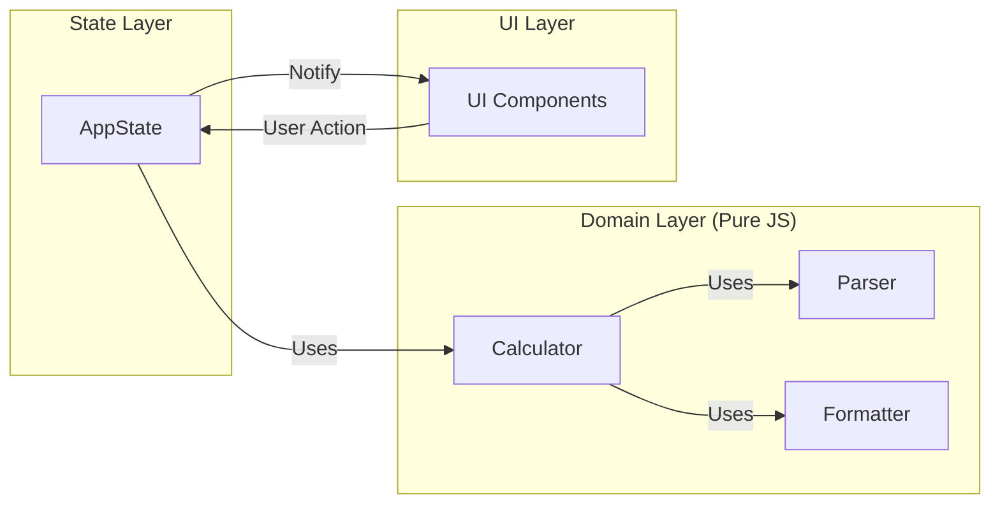

# 🧮 Scientific Calculator: Engineering Approach
> **Undergraduate Portfolio Project**
>
> *대학생 개발자가 소프트웨어 공학의 정석(TDD, SOLID, Clean Code)을 고민하고 적용해본 결과물입니다.*

---

## 🙋‍♂️ Intro: 이론을 실전으로
대학교 전공 수업에서 배운 **소프트웨어 공학**과 **객체 지향 프로그래밍**의 이론들이 실제 프로젝트에서 어떤 가치를 발휘하는지 직접 확인하고 싶었습니다.

단순히 "동작하는 계산기"를 만드는 것이 아니라, **"변화에 유연하고, 신뢰할 수 있으며, 읽기 쉬운 코드"**를 목표로 했습니다. 이 프로젝트는 학부생으로서 **현업 수준의 코드 품질**에 도전하고 성장해 나가는 과정을 담고 있습니다.

---

## 💡 Key Engineering Challenges
단순한 계산기처럼 보이지만, 그 내부에는 치열한 기술적 고민들이 담겨 있습니다.

### 1. "0.1 + 0.2 = 0.30000000000000004?" (정밀도 문제 해결)
컴퓨터의 부동소수점 연산 오류는 계산기 신뢰성에 치명적입니다.
- **Challenge**: JavaScript의 `number` 타입 한계로 인한 연산 오차 발생.
- **Solution**: `math.js` 라이브러리를 도입하여 정밀도 문제를 해결하는 동시에, `Calculator` 클래스 내부에 라이브러리 의존성을 격리하여 향후 다른 엔진으로 교체 가능하도록 설계했습니다.

### 2. "기능이 늘어날수록 코드가 엉키지 않을까?" (복잡도 관리)
단순 사칙연산에서 공학용 기능(sin, cos 등)으로 확장을 고려했습니다.
- **Challenge**: `if-else`가 난무하는 스파게티 코드를 방지해야 함.
- **Solution**: **SRP(단일 책임 원칙)**를 적용하여 `Parser`(해석), `Validator`(검증), `Calculator`(계산), `Formatter`(출력)로 역할을 철저히 분리했습니다. 결과적으로 새로운 연산자를 추가할 때 기존 코드를 거의 수정하지 않아도 되었습니다.

### 3. "UI와 로직은 어떻게 분리할까?" (TDD 활성화)
- **Challenge**: UI에 로직이 종속되면 테스트하기 어렵고 깨지기 쉬움.
- **Solution**: **Observer Pattern**을 적용한 `AppController`와 `AppState`를 구현했습니다. 순수 자바스크립트 객체의 상태 변경이 자동으로 UI 업데이트를 트리거하며, 이를 통해 UI 없이도 핵심 로직을 100% 테스트할 수 있었습니다.

---

## 🛠️ Tech Stack & Methodology
학부 수업에서 배운 내용들을 최대한 활용하고 심화시켰습니다.

- **Core**: Vanilla JavaScript (ES6+) - *기본기에 집중하기 위해 프레임워크 배제*
- **Test**: Vitest (Unit Testing) - *TDD 사이클(Red-Green-Refactor) 실천*
- **Design Pattern**: Observer, Strategy, Singleton - *유지보수성 향상*
- **CI/CD**: GitHub Actions - *자동화된 테스트 및 배포 프로세스 경험*
- **Style**: Tailwind CSS - *빠르고 일관된 디자인 시스템 구축*

---

## 🏗️ Architecture for Scalability
*"좋은 설계는 코드를 읽는 사람을 배려하는 것이다."*

철저한 계층 분리를 통해 비즈니스 로직(Domain)은 프레임워크나 UI 변경에 영향을 받지 않도록 보호했습니다.

---

## 🚀 Learning Outcomes
이 프로젝트를 진행하며 단순히 코드를 짜는 것을 넘어 '설계'의 중요성을 체감했습니다.

1.  **TDD의 효용성 체감**: 테스트 코드가 있으니 리팩토링이 두렵지 않았습니다. 기능 추가 시 발생할 수 있는 사이드 이펙트를 즉시 잡아낼 수 있었습니다.
2.  **커뮤니케이션으로서의 코드**: 나중에 다시 볼 '미래의 나'와 코드를 읽을 동료를 위해 변수명 하나, 함수 분리 하나에도 의미를 담으려 노력했습니다.
3.  **지속적인 통합의 가치**: PR을 올릴 때마다 자동으로 돌아가는 테스트 덕분에 항상 배포 가능한 상태(Deployable State)를 유지하는 습관을 들였습니다.

---

## 📊 Performance & Quality
- **Test Coverage**: Core Logic 90%+
- **Lighthouse Score**: 100 (Performance, A11y, Best Practices)
- **Responsive**: Mobile-First Design

---

  
이 프로젝트는 계속해서 성장 중입니다.

  
피드백은 언제나 환영합니다!

   
  
  

